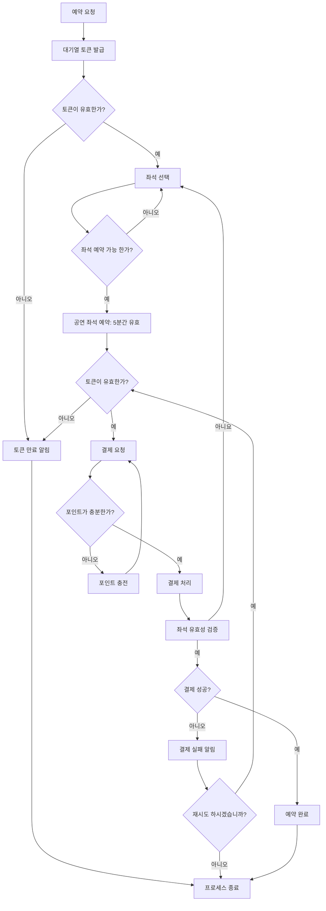

# Flow charts

플로우차트를 통해 유저가 어떻게 콘서트 예매를 진행하는지 확인 가능합니다.

```mermaid
graph TD
    A[예약 요청] --> B[대기열 토큰 발급]
    B --> C{토큰이 유효한가?}
    C -- 예 --> D[좌석 선택]
    C -- 아니오 --> K[토큰 만료 알림]
    K --> Z[프로세스 종료]

    D --> G{좌석 예약 가능 한가?}
    G -- 예 --> H[공연 좌석 예약: 5분간 유효]
    G -- 아니오 --> D

    H --> I{토큰이 유효한가?}
    I -- 예 --> J[결제 요청]
    I -- 아니오 --> K[토큰 만료 알림]

    J --> L{포인트가 충분한가?}
    L -- 예 --> M[결제 처리]
    L -- 아니오 --> N[포인트 충전]
    M --> Y[좌석 유효성 검증]
    N --> J

    Y -- 예 --> O{결제 성공?}
    Y -- 아니요 --> D
    O -- 예 --> P[예약 완료]
    O -- 아니오 --> Q[결제 실패 알림]
    Q --> R{재시도 하시겠습니까?}
    R -- 예 --> I
    R -- 아니오 --> Z

    P --> Z
```